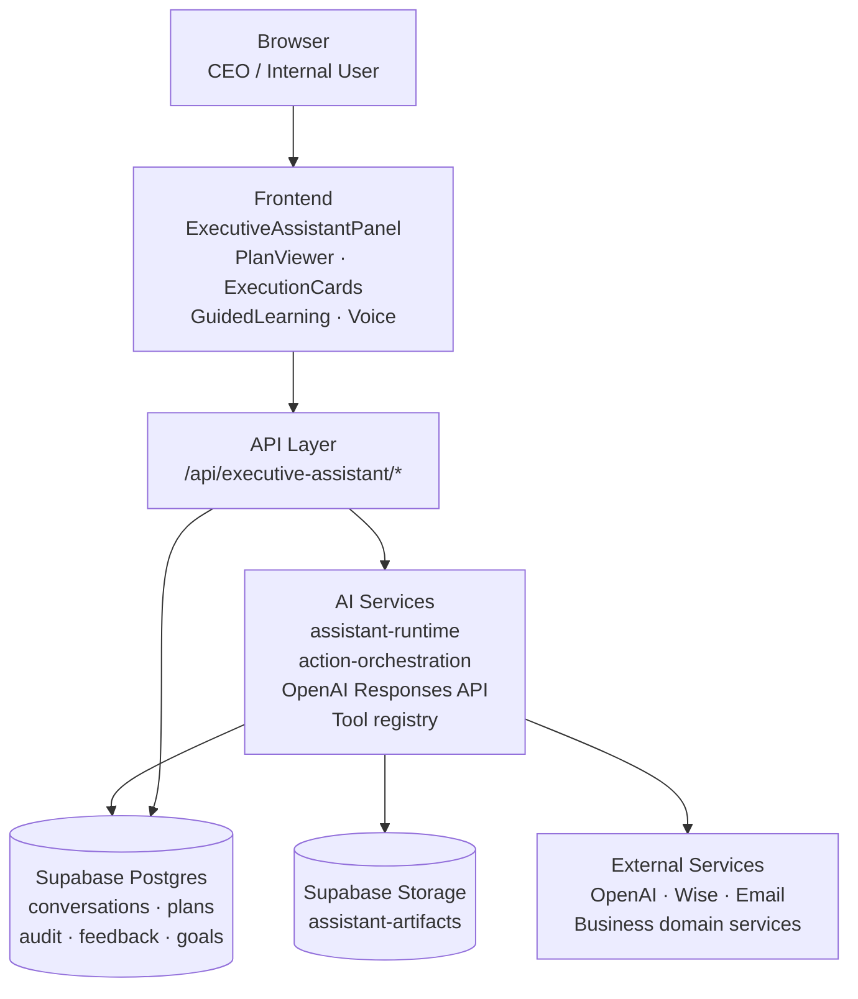
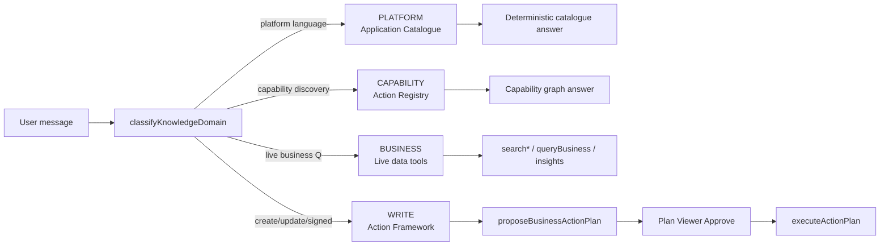
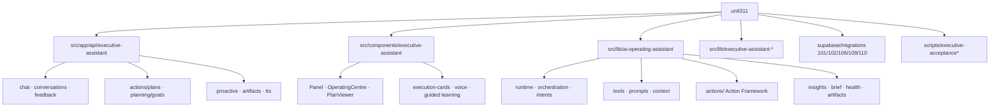
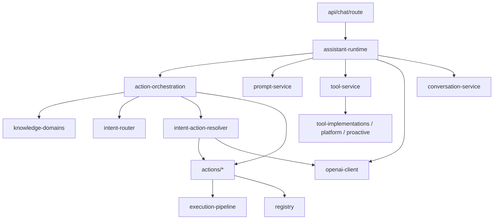
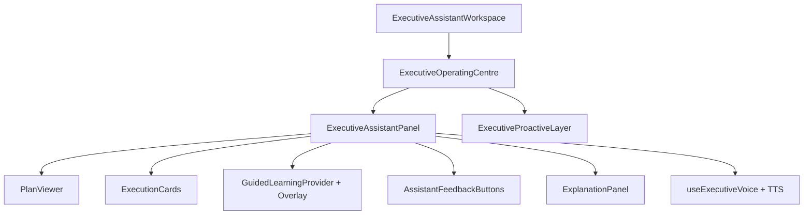
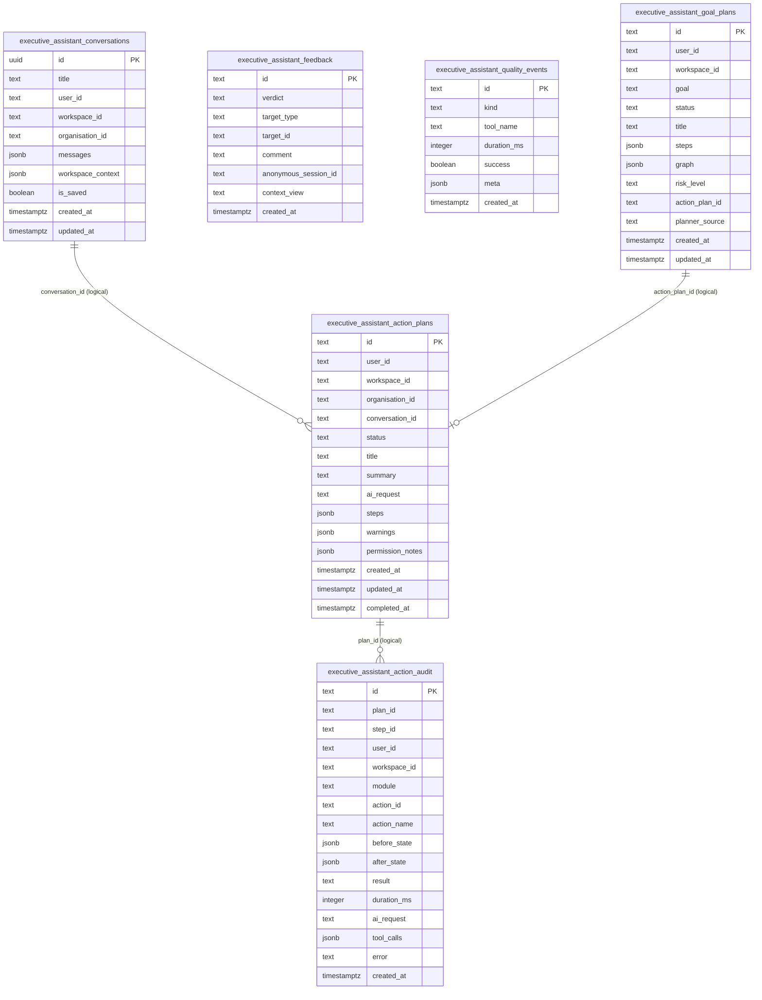
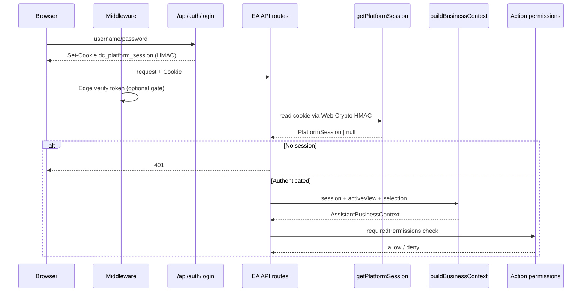
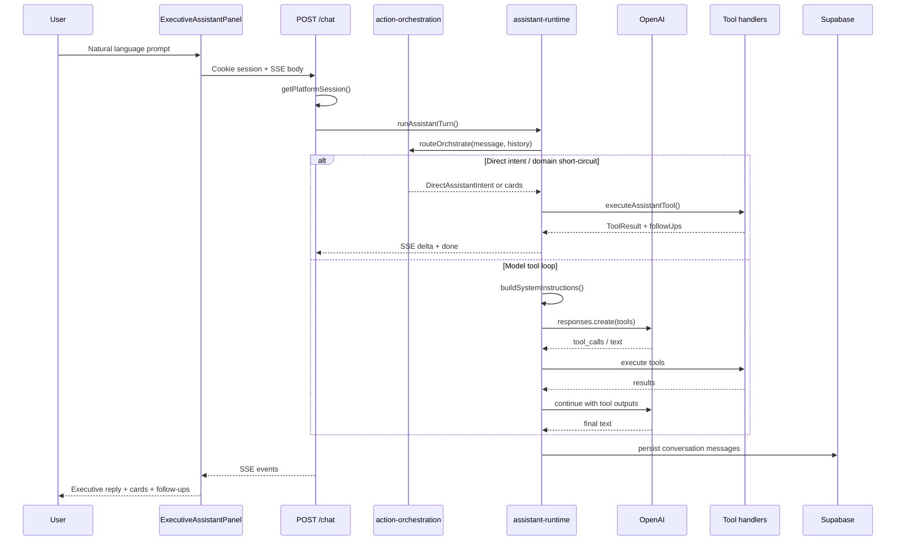
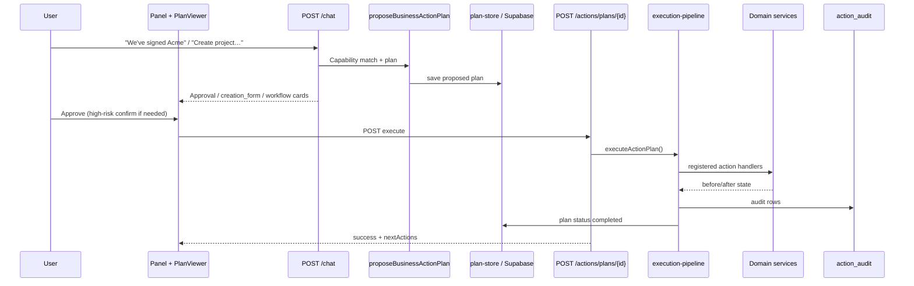
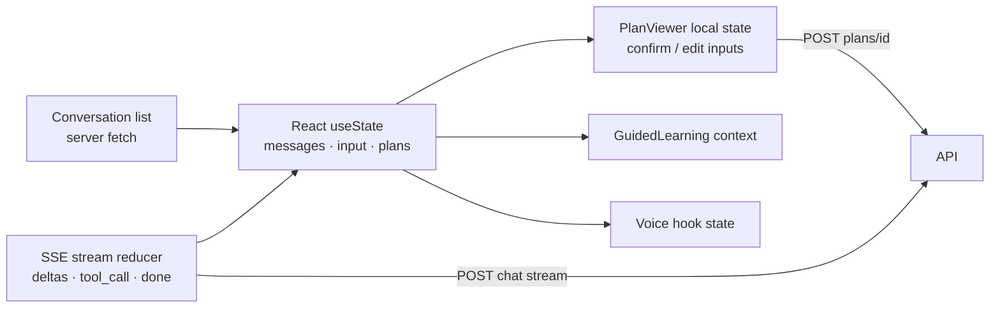

# Unit311 AI Executive Assistant — Software Architecture Report

| Field | Value |
| --- | --- |
| Product | Unit311 Central |
| Scope | AI Executive Assistant (Operating Assistant) |
| Codebase | `Unit311central/unit311central` (`Desktop\\unit311`) |
| Analysis date | 2026-07-24 |
| Classification | Internal — Senior Architect Handoff |
| Method | Static code inspection only (no application code modified) |

---

## Table of Contents

1. [Executive Summary](#1-executive-summary)
2. [High-Level Architecture](#2-high-level-architecture)
3. [Complete Folder Structure](#3-complete-folder-structure)
4. [AI Assistant Architecture](#4-ai-assistant-architecture)
5. [API Documentation](#5-api-documentation)
6. [Database Documentation](#6-database-documentation)
7. [Authentication](#7-authentication)
8. [AI Processing Pipeline](#8-ai-processing-pipeline)
9. [External Integrations](#9-external-integrations)
10. [Dependency Graph](#10-dependency-graph)
11. [State Management](#11-state-management)
12. [AI Prompt Architecture](#12-ai-prompt-architecture)
13. [Configuration](#13-configuration)
14. [Security Review](#14-security-review)
15. [Performance Review](#15-performance-review)
16. [Code Quality](#16-code-quality)
17. [Technical Debt](#17-technical-debt)
18. [Future Architecture](#18-future-architecture)
19. [File Inventory](#19-file-inventory)
20. [Visual Diagrams](#20-visual-diagrams)

---

## 1. Executive Summary

### 1.1 Overall architecture

The AI Executive Assistant is a **server-authoritative, tool-calling Operating Assistant** embedded in Unit311 Central. The browser hosts a rich chat/operating UI; all model calls, tool execution, and business mutations occur on the Next.js Node runtime behind authenticated cookie sessions.

It is organised around **three independent knowledge domains** plus a single gated write path:

1. **Platform** — Application Catalogue (modules / apps / pages)
2. **Capability** — Action Registry / Capability Graph (what the assistant can *do*)
3. **Business** — Live organisational data tools (clients, projects, finance, HR, CRM, …)
4. **Write** — Action Framework: propose plan → Plan Viewer approval → `executeActionPlan`

This separation is intentional and treated as a **frozen foundation**: new AI layers should not be added unless a real CEO scenario requires them.

### 1.2 Purpose

Enable a CEO / executive to **run the company through natural conversation** without navigating the application: overnight briefs, attention queues, sales onboarding, project creation, cash/overdue, people workload/leave, risk & delegation — with Chief-of-Staff tone, live facts, and confirmable mutations.

### 1.3 Current implementation maturity

| Area | Maturity | Notes |
| --- | --- | --- |
| Chat + SSE streaming | High | Dual contract: Operating Assistant + legacy JSON |
| Knowledge domain routing | High | Classifier + deterministic catalogue/capability answers |
| Direct CEO intents | High | Regression-gated via Executive Acceptance Suite |
| Action Framework (writes) | Medium–High | Clients module rich; Projects thin; other modules sparse |
| Conversation memory | Medium | Supabase JSONB history + entity memory in resolver |
| Proactive intelligence | Medium | Insights/health/brief; floating UI notifications largely retired |
| Voice / TTS | Medium | Present; secondary to text operating path |
| Goal / multi-step planning | Medium | Goal plans + graph executor exist; not primary CEO path |
| Enterprise isolation | Medium | Workspace claims + service-role DB; RLS locked down |
| Observability | Medium | Forensic correlation IDs; quality events table |
| Automated acceptance | High for CEO scenarios | `test:executive-acceptance` against production |

Approximate EA surface: **~25k LOC** across `ai-operating-assistant`, EA components, and EA API routes (~110 files in those trees).

### 1.4 Major strengths

- Clear **domain separation** (platform vs capability vs business vs write)
- **Single write gate** (Plan Viewer → execute) with audit trail
- Deterministic **CEO intent short-circuits** for operating questions
- Rich **tool surface** (40+ tools) over live domain services
- **Explainability / feedback** primitives
- Production **Executive Acceptance Suite** as the success metric
- Session auth never exposes `OPENAI_API_KEY` to the browser

### 1.5 Current limitations

- Action Registry coverage is uneven (clients-heavy; finance/HR writes largely absent)
- Serverless durability edge cases (plan rehydrate-from-client snapshot)
- Artifacts use in-memory cache + Storage fallback
- Large UI monolith (`ExecutiveAssistantPanel.tsx` ~1.5k lines)
- Legacy chat path still present alongside Operating Assistant
- No dedicated vector RAG / knowledge base service
- Multi-agent orchestration not present (single runtime loop)

### 1.6 Technical debt (summary)

- Dual chat contracts (legacy vs operating)
- Oversized panel + runtime files
- Capability modules beyond clients/projects incomplete
- Logical FKs only between EA tables
- Guided-learning tools can conflict with “execution first” if mis-routed

### 1.7 Recommended next evolution

1. Expand Action Registry modules (finance, HR, CRM writes) behind the same Plan Viewer gate  
2. Harden plan durability (no client rehydrate as primary path)  
3. Split `ExecutiveAssistantPanel` into conversation / composer / cards / voice  
4. Promote acceptance suite into CI on every production deploy  
5. Add optional RAG only when a real scenario needs document grounding  
6. Keep single-agent tool-calling; introduce multi-agent only for proven parallel domains  

---

## 2. High-Level Architecture

### Layer responsibilities

| Layer | Responsibility |
| --- | --- |
| Browser | Render Operating Centre; stream SSE; collect approvals; voice I/O |
| Frontend | Panel, Plan Viewer, execution cards, guided learning, proactive hooks |
| API | Auth, request validation, SSE/JSON responses, plan execution endpoints |
| AI Services | Orchestration, prompts, OpenAI, tools, action execution |
| Database | Conversations, plans, audit, feedback, quality events, goal plans |
| External | OpenAI; domain data services; optional Wise/email/storage |

Knowledge domain routing:

---

## 3. Complete Folder Structure

| Folder | Purpose |
| --- | --- |
| `src/app/api/executive-assistant/` | HTTP surface for chat, conversations, plans, goals, proactive, artifacts, TTS, feedback |
| `src/components/executive-assistant/` | CEO-facing UI |
| `src/components/testflighthub/ExecutiveAssistantWorkspace.tsx` | Dashboard workspace shell |
| `src/lib/ai-operating-assistant/` | **Core product logic** |
| `src/lib/executive-assistant-*.ts` | Legacy helpers (AI complete, context snapshot, UI/voice utils) |
| `src/lib/platform-session*.ts` | Cookie session HMAC |
| `src/lib/supabase/` | Service-role / anon clients |
| `supabase/migrations/101,102,106,109,110` | EA schema |
| `scripts/executive-acceptance*.mjs` | CEO acceptance + intent gates |
| `docs/executive-assistant-architecture/` | This architecture pack |

### Conventional trees vs EA

| Convention | EA usage |
| --- | --- |
| `app/` | Route handlers under `api/executive-assistant` |
| `components/` | Isolated under `executive-assistant/` |
| `hooks/` | Voice hook colocated under `voice/` |
| `lib/` | Primary home for EA domain logic |
| `services/` | Domain services as `src/lib/*-service.ts` consumed by tools/actions |
| `api/` | Next App Router `route.ts` files |
| `database/` | SQL in `supabase/migrations` |
| `types/` | Colocated (`types.ts`, `executive-types.ts`, `actions/types.ts`) |
| `utils/` | Colocated helpers |

---

## 4. AI Assistant Architecture

### 4.1 Core components

| Component | Purpose | Responsibilities | Inputs | Outputs | Key files |
| --- | --- | --- | --- | --- | --- |
| Chat API | HTTP entry | Auth, parse, SSE/JSON | Cookie + chat request | SSE / JSON | `api/.../chat/route.ts` |
| `runAssistantTurn` | Turn loop | History, route, tools/model, persist | Session + request | Event stream | `assistant-runtime.ts` |
| `action-orchestration` | Domain routing | Platform/capability/business/write | Message + history + context | Intent / cards / null | `action-orchestration.ts` |
| `knowledge-domains` | Classifier | Choose domain | Message | Domain + reason | `knowledge-domains.ts` |
| `intent-router` | Direct CEO intents | Deterministic tool selection | Message + history | Direct intent | `intent-router.ts` |
| `intent-action-resolver` | Write → capability | Entity memory, match, propose | Message + history | Plan / need_info | `intent-action-resolver.ts` |
| `prompt-service` | System prompt | CoS instructions + context | Business context | System string | `prompt-service.ts` |
| `tool-service` | Tool catalogue | Descriptors + dispatch | Name + args | ToolResult | `tool-service.ts` |
| Tool impls | Live ops | Domain queries / PDFs | Args + context | Structured results | `tool-implementations.ts`, `platform-tools.ts`, `proactive-tools.ts` |
| Action Framework | Writes | Registry, preview, execute, audit | Plan steps | Mutations + audit | `actions/**` |
| Conversation service | Memory | CRUD threads | User + messages | Rows | `conversation-service.ts` |
| Execution cards | UI contracts | Forms, workflows, approvals | Outcomes | Card JSON | `execution-cards.ts` |
| Intelligence | Brief/insights/health | Analyse platform | Context | Scores / insights | `daily-brief-service.ts`, `insight-service.ts`, `business-health-service.ts` |
| OpenAI client | Model access | Responses API | Params | Model response | `openai-client.ts` |
| Forensic trace | Ops debug | Correlation stages | Turn metadata | Logs / headers | `ea-forensic-trace.ts` |

### 4.2 Module relationships

### 4.3 Registered write capabilities

**Clients:** `clients.createClient`, `updateClient`, `archiveClient`, `restoreClient`, `assignAccountManager`, `addClientContact`, `updateClientContact`, `removeClientContact`, `createClientLocation`, `mergeDuplicateClients`.

**Projects:** `projects.createProject`.

Writes require confirmation and typically audit.

### 4.4 Tool catalogue (summary)

`queryBusiness`, `searchClients`, `searchProjects`, `searchEmployees`, `searchLeave`, `searchInvoices`, `searchExpenses`, `getCashPosition`, `searchCRM`, `platformSearch`, `getDailyBrief`, `getSmartInsights`, `getBusinessHealth`, PDF generators, payroll tools, guided-learning tools, `listPlatformModules`, `searchApplications`, `listBusinessActions`, `searchCapabilities`, `proposeBusinessActionPlan`, `planBusinessGoal`, and related helpers.

### 4.5 UI hierarchy

---

## 5. API Documentation

Base path: `/api/executive-assistant`. Session required unless noted.

### 5.1 `POST /chat`

| Item | Detail |
| --- | --- |
| Purpose | Primary Operating Assistant turn (SSE default) |
| Auth | `getPlatformSession` → 401 if missing |
| Request | `{ message, messages?, conversationId?, activeView?, pathname?, selection?, roleView?, stream?, structuredJson? }` |
| Stream events | `tool_call`, `tool_result`, `delta`, `done`, `error` |
| Non-stream | `{ reply, conversationId, correlationId }` |
| Legacy | Legacy body → `completeExecutiveAssistantChat` JSON |
| Errors | 400 / 401 / 502 |
| Files | `chat/route.ts` → `runAssistantTurn` |

### 5.2 Other endpoints

| Route | Methods | Purpose |
| --- | --- | --- |
| `/conversations` | GET, POST | List / create |
| `/conversations/[id]` | GET, PATCH, DELETE | Load / update / delete |
| `/actions` | GET | List action descriptors |
| `/actions/plans` | GET, POST | List / create plans |
| `/actions/plans/[id]` | GET, POST | Load / **execute** plan |
| `/planning/goals` | GET, POST | Goal plans |
| `/planning/goals/[id]` | GET, POST | Inspect / run goal |
| `/proactive` | GET, POST | Insights / health / release / optional brief |
| `/artifacts/[id]` | GET | PDF download/inline |
| `/feedback` | POST | Anonymous verdict |
| `/tts` | POST | Speech synthesis |

**Validation:** manual TypeScript parsing on routes; action `inputSchema` on capabilities.  
**Persistence:** conversations/plans need `SUPABASE_URL` + `SUPABASE_SERVICE_ROLE_KEY` (else unavailable/503).  
**Correlation:** `x-ea-correlation-id` on SSE.

---

## 6. Database Documentation

### Tables

| Table | Migration | Role |
| --- | --- | --- |
| `executive_assistant_conversations` | 101 (+106 saved flag) | Thread JSONB messages |
| `executive_assistant_feedback` | 102 | Anonymous feedback |
| `executive_assistant_quality_events` | 102 | Telemetry |
| `executive_assistant_action_plans` | 109 | Proposed/executed plans |
| `executive_assistant_action_audit` | 109 | Before/after audit |
| `executive_assistant_goal_plans` | 110 | Goal graphs |

### Relationships

Logical text references only (`conversation_id`, `plan_id`, `action_plan_id`) — **no Postgres FKs**.

### Indexes

User/updated, workspace/updated, status/updated, verdict/created, plan/action audit indexes as defined in migrations.

### Policies / RLS

RLS enabled; **no permissive policies** for anon/authenticated. Access via service role from Next.js only.

### Views / functions / triggers

None EA-specific in these migrations.

### Storage

Bucket `assistant-artifacts` (private), path `{userId}/{artifactId}.pdf`, plus in-memory Map (max ~40) with base64 fallback.

### Broader data

Tools read live operational tables via domain services (clients, projects, invoices, HR, CRM, …) — outside EA schema but critical dependencies.

---

## 7. Authentication

1. Login sets `dc_platform_session` (JSON payload + HMAC-SHA256 with `AUTH_SECRET`)  
2. EA routes use `getPlatformSession()` (React `cache` dedupe)  
3. `buildBusinessContext` attaches permissions / workspace / selection  
4. Action Framework enforces `requiredPermissions`  

Not a standard JWT — custom HMAC token (Edge-safe Web Crypto). Max age 7 days. Production fails if `AUTH_SECRET` unset (must not use anon key).

---

## 8. AI Processing Pipeline

Write path:

Flow: User prompt → Frontend → API → Orchestration / Prompt builder → OpenAI and/or deterministic tools → DB persistence → UI (SSE + cards + Plan Viewer).

---

## 9. External Integrations

| Integration | Purpose | Secrets / config | Failure handling |
| --- | --- | --- | --- |
| OpenAI | Model + tools | `OPENAI_API_KEY`, `OPENAI_ASSISTANT_MODEL` | Throw if unset; retry 408/429/5xx; 502 to client |
| Supabase Postgres | EA + business data | `SUPABASE_URL`, service role | Persistence unavailable modes |
| Supabase Storage | PDFs | Service role | Memory/base64 fallback |
| Vercel | Hosting | Git `main` deploys | Cold start; plan rehydrate mitigation |
| Platform auth | Sessions | `AUTH_SECRET` | Fail closed in production |
| Wise (optional) | Cash enrichment | Connection APIs | Degrade to treasury figures |
| Email | Artifact send | `UNIT311_BOARD_EMAIL` / `BOARD_EMAIL` | Tool error |
| Domain services | Live ops data | Existing app env | Tool error/forbidden |
| TTS | Speech | Route env | Soft-fail in UI |

---

## 10. Dependency Graph

Core module graph: see §4.2 / `diagrams/08-module-dependencies.mmd`.

**Circular risk:** action modules auto-register on import while orchestration also bootstraps — mitigated by idempotent upsert.

**Legacy:** `executive-assistant-ai.ts` still reachable via chat dual contract.

---

## 11. State Management

React local state in Panel; GuidedLearning context; voice hook; server fetches for conversations/plans; session request cache; artifact Map. Writes are confirmation-gated (not optimistic).

---

## 12. AI Prompt Architecture

**System prompt** (`prompt-service.ts`): Chief of Staff persona; three knowledge sources; routing order; brevity; execution-first; forbid UI teaching; require live tools for risk/overdue/workload.

**Injection:** user/org/page/selection/permissions JSON; topic hint; active artifact; active client entity.

**Memory:** conversation JSONB + resolver entity memory (no vector store).

**Formatting:** direct-intent formatters for lists/brief/insights/CRM/cash; follow-ups from tools/plans; acceptance suite rejects bare `Done.`.

**Structured output:** `AssistantToolResult`, execution cards, optional `structuredJson` mode.

---

## 13. Configuration

| Variable | Role |
| --- | --- |
| `OPENAI_API_KEY` | Model access |
| `OPENAI_ASSISTANT_MODEL` | Optional (default `gpt-4o-mini`) |
| `AUTH_SECRET` | Session HMAC |
| `SUPABASE_URL` | DB/storage |
| `SUPABASE_SERVICE_ROLE_KEY` | EA persistence |
| `UNIT311_BOARD_EMAIL` / `BOARD_EMAIL` | Artifact email |

Scripts: `test:executive-acceptance`, `test:executive-intents`, `test:ea-domains`, `test:ea-intelligence`.

---

## 14. Security Review

| Area | Assessment |
| --- | --- |
| Auth | Cookie HMAC; production requires `AUTH_SECRET` |
| Authz | Permission flags + workspace scoping in client helpers |
| Validation | Route parsing + action `inputSchema` |
| SQLi | Supabase client parameterisation |
| XSS | React escaping; keep assistant HTML sanitised |
| CSRF | Same-site session cookie model |
| Secrets | OpenAI + service role server-only |
| RLS | Locked tables; **service-role trust boundary is critical** |
| Writes | Confirmation + audit reduce blast radius |
| Risks | Prompt injection mitigated by tool allowlist + confirmations; plan rehydrate must not bypass authz |

---

## 15. Performance Review

- Large client panel; SSE helps perceived latency  
- Snapshot/insight tools can be multi-query heavy  
- JSONB conversation growth needs retention policy  
- Hotspots: Panel ~1487 LOC, runtime ~1191, tool-implementations ~933  
- Acceptance suite ~3+ minutes live — gate CI thoughtfully  

---

## 16. Code Quality

Strong conceptual architecture and registry extensibility; god-files hurt SRP; dual legacy path increases cognitive load; naming mostly consistent; maintainability high **if** domain freeze is respected.

---

## 17. Technical Debt

1. Dual chat contracts  
2. God files (Panel, Runtime)  
3. Incomplete Action modules  
4. Logical-only FKs  
5. Plan rehydrate-from-client  
6. Artifact memory Map multi-instance limits  
7. Guided-learning vs execution-first tension  
8. Example/dead-ish files  
9. Formalise acceptance credentials for CI  
10. Continued prompt-injection hardening  

---

## 18. Future Architecture

**Service boundaries:** Conversation, Cognition, Capability (writes), Intelligence, Artifact, Acceptance Gate — keep **one write path**.

**Scale:** Durable plans/artifacts in Supabase; optional background for heavy insights.

**Agents:** Stay single-agent; specialists only behind same façade.

**RAG:** Add only for real document Q&A scenarios.

**Workflows:** Grow Action Registry + capability workflows; goal planner remains advanced/optional.

---

## 19. File Inventory

### API (~1.3k lines combined)

See §5 routes under `src/app/api/executive-assistant/**`.

### Library highlights

| File | ~Lines | Purpose |
| --- | --- | --- |
| `assistant-runtime.ts` | 1191 | Turn loop / formatters |
| `tool-implementations.ts` | 933 | Search/report tools |
| `tool-service.ts` | 828 | Descriptors + dispatch |
| `platform-tools.ts` | 684 | HR/finance/platformSearch |
| `intent-action-resolver.ts` | 574 | Write resolution |
| `actions/planning/planner.ts` | 535 | Goal planning |
| `actions/planning/graph-executor.ts` | 535 | Goal execution |
| `actions/capability-service.ts` | 530 | Capability matching |
| `actions/execution-pipeline.ts` | 514 | Execute plans |
| `insight-service.ts` | 503 | Insights |
| `intent-router.ts` | 488 | Direct intents |
| `application-catalogue.ts` | 472 | Platform answers |
| `proactive-tools.ts` | 463 | Brief/insights tools |
| `action-orchestration.ts` | 275 | Domain router |
| `conversation-service.ts` | 265 | Persistence |
| `knowledge-domains.ts` | 100 | Classifier |
| `prompt-service.ts` | 71 | System prompt |
| `openai-client.ts` | 35 | OpenAI wrapper |

Full tree: `src/lib/ai-operating-assistant/**` (~83 files) including actions modules, PDF services, guided learning, explainability, audit, plan/goal stores, tests under `__tests__/`.

### UI

| File | ~Lines |
| --- | --- |
| `ExecutiveAssistantPanel.tsx` | 1487 |
| `voice/useExecutiveVoice.ts` | 446 |
| `execution-cards/ExecutionCards.tsx` | 339 |
| `PlanViewer.tsx` | 304 |
| `GuidedLearningProvider.tsx` | 271 |
| `GuidedLearningOverlay.tsx` | 219 |
| `ExecutiveOperatingCentre.tsx` | 165 |

Plus feedback, explanation, voice chrome, proactive layer, workspace shell.

### Migrations & scripts

101, 102, 106, 109, 110 SQL; `executive-acceptance-suite.mjs`, `executive-acceptance-intents.mjs`, `verify-ea-*.mjs`.

---

## 20. Visual Diagrams

| File | Content |
| --- | --- |
| `diagrams/01-high-level-architecture.mmd` | Overall layers |
| `diagrams/02-knowledge-domains.mmd` | Domain routing |
| `diagrams/03-ai-request-lifecycle.mmd` | Chat sequence |
| `diagrams/04-write-path.mmd` | Approve/execute |
| `diagrams/05-auth-flow.mmd` | AuthN/Z |
| `diagrams/06-database-er.mmd` | EA ER |
| `diagrams/07-component-hierarchy.mmd` | UI tree |
| `diagrams/08-module-dependencies.mmd` | Modules |
| `diagrams/09-folder-tree.mmd` | Folders |
| `diagrams/10-state-flow.mmd` | State |

---

## Appendix A — Success metric

> Success is measured by whether a CEO can manage the business without navigating the application.

Regression: Executive Acceptance Suite (Company Overview, Sales, Projects, Finance, People, Operations).

## Appendix B — Architecture freeze

Do **not** add new AI capability layers unless required by a real business scenario. Prefer extending `intent-router` / `knowledge-domains`, Action Registry modules, and tool formatters.

## Appendix C — Documentation / control-plane gaps (inventory pass)

1. Product doc `docs/EXECUTIVE_AI_PLATFORM.md` still emphasises migrations **101–102**; codebase also ships **106, 109, 110** — treat this architecture pack as the schema source of truth until that doc is updated.
2. Dual chat stacks remain: Operating Assistant (`openai-client` + Responses/tools) vs legacy (`executive-assistant-ai` / Gateway OIDC).
3. Goal graph executor exists server-side, but HTTP goal execute is effectively **disabled** — UI must use the Action Plan / Plan Viewer path.
4. Surface flag: `EXECUTIVE_ASSISTANT_VISIBLE` in `product-surface-flags.ts` gates dashboard visibility.
5. Related hosts: `PlatformFloatingAiAssistant`, `HomeExecutiveAssistantPanel`, Survey Operations shell — not only the dedicated EA workspace.

---

*End of report. Static analysis of `Desktop\\unit311` on 2026-07-24. Application code was not modified.*
