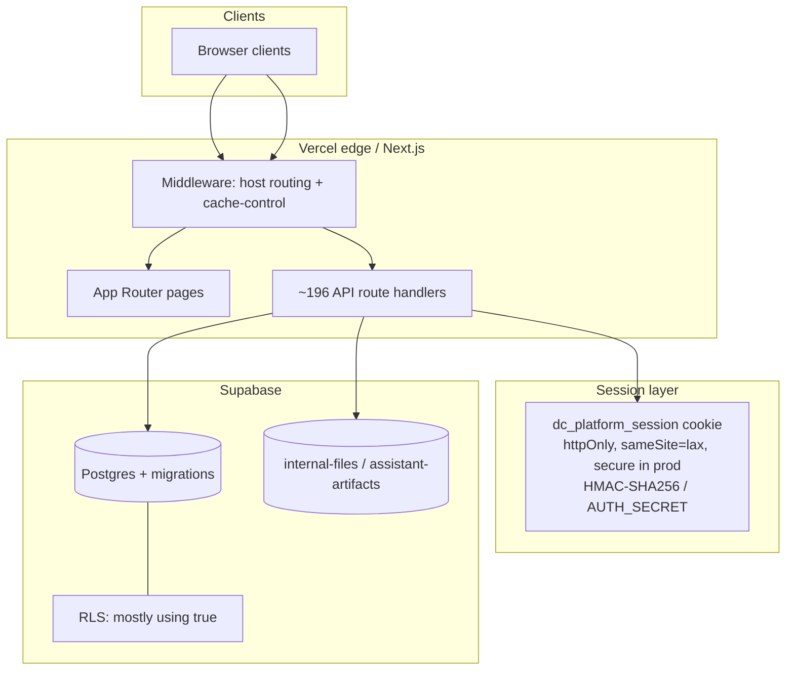

# EU Cyber Resilience Act — Documentation Pack Overview

| Field | Value |
|---|---|
| Document ID | CRA-01 |
| Version | 1.0 |
| Status | Draft — evidence-based baseline |
| Owner | Unit311 Platform Engineering / Security |
| Last updated | 2026-07-22 |
| Related documents | CRA-02 Roadmap; CRA-17 Gap Analysis; CRA-18 Evidence Register; CRA-19 Action Tracker |

## 1. Purpose

This pack establishes an evidence-based baseline for Unit311’s alignment with the EU Cyber Resilience Act (CRA). It documents observed technical controls, known gaps, and remediation priorities toward the December 2027 CRA applicability deadline. Claims in this pack are derived from a platform security audit of the Unit311central codebase and deployment topology; controls that were not verified are not asserted.

## 2. In-scope product

| Attribute | Observed value |
|---|---|
| Product | Unit311 platform (web application) |
| Framework | Next.js 16.2.9, React 19.2.4 |
| Hosting | Vercel project `unit311central` |
| Backend / data | Supabase (`@supabase/supabase-js`) |
| Source control | GitHub `Unit311central/unit311central`, branch `main` |
| Deploy path | Vercel Git integration from `main` |

The platform exposes marketing surfaces, authenticated workspaces (internal and external roles), approximately 196 API route handlers, and supporting integrations (including WhatsApp support flows and cron jobs).

## 3. Documentation pack map

| ID | Document | Primary CRA theme |
|---|---|---|
| CRA-01 | Overview (this document) | Scope & structure |
| CRA-02 | CRA Compliance Roadmap | Timeline to Dec 2027 |
| CRA-03 | Secure Development Lifecycle | Secure by design / SDL |
| CRA-04 | Secure Coding Standards | Vulnerability prevention |
| CRA-05 | Authentication & Access Control | Identity & authorization |
| CRA-06 | Cryptography & Encryption | Confidentiality of data |
| CRA-07 | Dependency & Supply Chain | Third-party components |
| CRA-08 | SBOM | Software bill of materials |
| CRA-09 | Vulnerability Management | Handling & disclosure |
| CRA-10 | Incident Response Plan | Security incident handling |
| CRA-11 | Security Update Policy | Patch & update obligations |
| CRA-12 | Release Management | Controlled delivery |
| CRA-13 | Technical Security Architecture | Architecture evidence |
| CRA-14 | Risk Assessment | Risk identification |
| CRA-15 | Disaster Recovery | Availability recovery |
| CRA-16 | Business Continuity | Continuity of operations |
| CRA-17 | Compliance Gap Analysis | Gap inventory |
| CRA-18 | Evidence Register | Audit artifacts |
| CRA-19 | Action Tracker | Remediation backlog |

## 4. High-level security architecture (observed)

## 5. Baseline posture summary

**Present (audit-verified):**

- Cookie-based session authentication with HMAC-SHA256 signing (`AUTH_SECRET`), httpOnly cookie `dc_platform_session`, `sameSite=lax`, `secure` in production.
- Password hashing with scrypt; role model distinguishing internal vs external users; Admin via `internal_operators`; workspace-level authorization checks on many routes.
- Application-level AES-256-GCM for software-asset passwords (`AUTH_SECRET`) and integration credentials (`INTEGRATION_CREDENTIALS_SECRET`).
- TLS termination provided by Vercel.
- Private storage buckets (`internal-files`, `assistant-artifacts`) with signed URL access patterns.
- Executive Assistant tables (migrations 101/102) without open RLS policies (service-role access only).
- `package-lock.json` present for dependency pinning.
- Vercel Instant Rollback available for deploy recovery.

**Absent or weak (Compliance gaps):**

- No login MFA.
- Deterministic password salt pattern `${username}-salt-v1`.
- Per-route auth only (no global auth middleware); uneven enforcement (e.g., competitors routes open; WhatsApp secret optional).
- No CSRF tokens; no application-level rate limiting.
- No CSP, HSTS, or X-Frame-Options configured in `next.config.ts`, `vercel.json`, or middleware.
- Broad RLS `using(true)` on most tables; historically permissive storage policies.
- No Dependabot, no SBOM tooling, minimal GitHub Actions (Android APK build only).
- Console logging and `WorkspaceErrorBoundary` only — no Sentry or centralized security monitoring.
- No formal RTO/RPO or business continuity plan (ad-hoc recovery notes only).

## 6. How to use this pack

1. Read **CRA-17 Compliance Gap Analysis** for the consolidated gap inventory.
2. Track remediation in **CRA-19 Action Tracker**.
3. Attach or link artifacts in **CRA-18 Evidence Register** as controls are implemented.
4. Follow **CRA-02 CRA Compliance Roadmap** for sequencing toward December 2027.

## 7. Document control

This overview is a living index. When a control is implemented, update the owning CRA document, the evidence register (CRA-18), and the action tracker (CRA-19) in the same change set.
