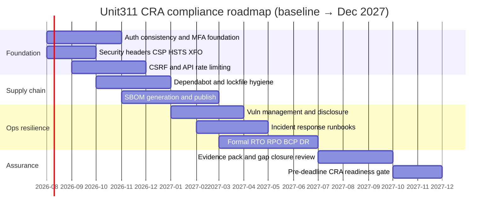

# CRA Compliance Roadmap

| Field | Value |
|---|---|
| Document ID | CRA-02 |
| Version | 1.0 |
| Status | Draft — evidence-based baseline |
| Owner | Unit311 Platform Engineering / Security |
| Last updated | 2026-07-22 |
| Related documents | CRA-01 Overview; CRA-17 Gap Analysis; CRA-19 Action Tracker; CRA-11 Security Update Policy |

## 1. Objective

Define a sequenced path from the current Unit311 audit baseline to CRA-ready product security posture by the December 2027 deadline. This roadmap prioritizes controls that close the highest-severity gaps identified in the audit (authentication consistency, transport/security headers, supply-chain visibility, vulnerability handling, and formal DR/BCP).

## 2. Anchor facts

| Fact | Value |
|---|---|
| CRA target | December 2027 applicability |
| Product | Unit311 on Vercel (`unit311central`) |
| Stack | Next.js 16.2.9 / React 19.2.4 / Supabase |
| Repo | GitHub `Unit311central/unit311central` (`main`) |
| Current CI | `build-android-apk.yml` only; web via Vercel Git |
| Formal DR/BCP | Not established |

## 3. Roadmap phases

## 4. Phase detail

### Phase A — Foundation (Aug–Dec 2026)

| Workstream | Audit driver | Target outcome | Owner docs |
|---|---|---|---|
| Global auth enforcement | Per-route auth; competitors open; WhatsApp secret optional | Deny-by-default API middleware + route inventory | CRA-05, CRA-13 |
| MFA for login | No login MFA | MFA for internal operators first, then privileged external roles | CRA-05 |
| Password salt redesign | Deterministic `${username}-salt-v1` | Per-user random salt with migration path | CRA-05, CRA-06 |
| Security headers | No CSP/HSTS/X-Frame in app config | Headers via middleware or Vercel config | CRA-13 |
| CSRF + rate limits | None present | Token/cookie pattern for state-changing routes; edge or app rate limits | CRA-04, CRA-05 |

**Compliance gap:** Foundation controls are not yet implemented. Recommendation: complete Phase A before expanding feature surface area that adds new API routes.

### Phase B — Supply chain (Oct 2026 – Mar 2027)

| Workstream | Audit driver | Target outcome | Owner docs |
|---|---|---|---|
| Automated dependency alerts | No Dependabot | Enable Dependabot or equivalent on `package-lock.json` | CRA-07 |
| SBOM | No SBOM tooling | Generate SBOM per release (CycloneDX or SPDX) | CRA-08 |
| CI security gates | Only Android APK workflow | Add web lint/test/security scan on PRs to `main` | CRA-03, CRA-12 |

### Phase C — Operations & resilience (Jan–Jul 2027)

| Workstream | Audit driver | Target outcome | Owner docs |
|---|---|---|---|
| Vulnerability process | Ad-hoc only | Intake, triage SLA, disclosure channel | CRA-09 |
| Incident response | No formal IR plan | Roles, severity, notification, post-incident | CRA-10 |
| Security updates | No formal policy | Support window + update cadence | CRA-11 |
| DR / BCP | Instant Rollback + ad-hoc notes only | Documented RTO/RPO, tested recovery | CRA-15, CRA-16 |

### Phase D — Assurance (Jul–Dec 2027)

- Close open items in **CRA-19 Action Tracker**.
- Populate **CRA-18 Evidence Register** with configs, policies, and test records.
- Re-run gap analysis (**CRA-17**) and produce a readiness attestation for leadership.

## 5. Decision gates

| Gate | Criteria |
|---|---|
| G1 — Auth freeze | Inventory of ~196 routes classified; open routes documented or closed |
| G2 — Supply-chain baseline | Dependabot live; SBOM artifact attached to releases |
| G3 — Ops ready | IR plan exercised; update policy published; RTO/RPO approved |
| G4 — CRA readiness | No Critical/High open gaps without compensating control or accepted risk |

## 6. Dependencies and risks

- **RLS `using(true)` on most tables** — requires coordinated schema/policy work with Supabase migrations; schedule with Phase A/C.
- **Storage policies historically permissive** — review `internal-files` and `assistant-artifacts` before expanding signed-URL consumers.
- **No centralized monitoring (no Sentry)** — incident detection remains console/`WorkspaceErrorBoundary`-centric until observability is added.
- **Single primary deploy path (Vercel from `main`)** — release controls in CRA-12 must not block emergency Instant Rollback.

## 7. Reporting cadence

| Cadence | Artifact |
|---|---|
| Monthly | Update CRA-19 action statuses |
| Quarterly | Refresh CRA-17 gap scores |
| Pre-release | Confirm CRA-08 SBOM + CRA-12 checklist |
| Annual (from 2027) | Full pack revision |

## 8. Success definition (Dec 2027)

Unit311 can demonstrate: consistent authentication and authorization, documented cryptography, supply-chain and SBOM practices, vulnerability and incident processes, security update commitments, and tested recovery — with evidence linked in CRA-18 and residual risks accepted explicitly in CRA-14.
