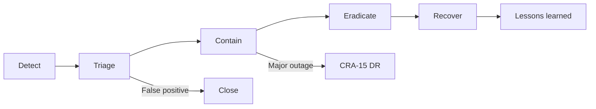

# Incident Response Plan

| Field | Value |
|---|---|
| Document ID | CRA-10 |
| Version | 1.0 |
| Status | Draft — evidence-based baseline |
| Owner | Unit311 Platform Engineering / Security |
| Last updated | 2026-07-22 |
| Related documents | CRA-09 Vulnerability Management; CRA-11 Security Update Policy; CRA-15 Disaster Recovery; CRA-16 Business Continuity |

## 1. Purpose

Provide an initial incident response (IR) framework for Unit311central. The audit confirmed **no formal IR program** and **no Sentry**; detection today is primarily `console` logging and `WorkspaceErrorBoundary`. This plan is therefore a draft operating model that must be exercised and evidence-backed before December 2027.

## 2. Scope

| In scope | Out of scope (separate tracks) |
|---|---|
| Security incidents affecting Unit311 web app on Vercel | Corporate HR / physical security |
| Session/auth compromise, data exposure via API or storage | Provider-wide Vercel/Supabase regional failures (coordinate via CRA-15) |
| Supply-chain compromise of npm or GitHub `main` | Customer on-premise environments (N/A) |

## 3. Incident lifecycle

## 4. Roles (minimum viable)

| Role | Responsibility |
|---|---|
| Incident Commander (IC) | Declares severity; coordinates; owns timeline |
| Platform lead | Vercel deploys, Instant Rollback, env secrets |
| Data lead | Supabase access review, storage signed URL revocation |
| Communications | Internal stakeholders; customer notice if required |
| Scribe | Timeline, evidence links for CRA-18 |

**Compliance gap:** Named on-call roster and paging not documented. Recommendation: assign primary/backup IC and publish contact tree before CRA readiness gate G3 (CRA-02).

## 5. Severity model

| Severity | Definition (Unit311-oriented) | Examples |
|---|---|---|
| Sev-1 | Active exploit or confirmed credential dump | Stolen `AUTH_SECRET`; mass unauthorized API access |
| Sev-2 | Likely exploitable high-impact flaw in production | Auth bypass on workspace API; open webhook forging data |
| Sev-3 | Limited exposure or defense-in-depth failure | Missing headers exploited for clickjacking attempt |
| Sev-4 | Suspected anomaly without confirmed impact | Odd console errors; single failed cron auth |

## 6. Detection sources (current vs target)

| Source | Current | Target |
|---|---|---|
| Application logs | `console` | Structured logs + retention |
| UI faults | `WorkspaceErrorBoundary` | Correlated with backend errors |
| APM / Sentry | **Absent — Compliance gap** | Production error + security event alerting |
| Vercel | Deploy/runtime dashboards | Alert on error spikes / auth failures |
| GitHub | Push/deploy to `main` | Protected branch + unexpected workflow runs |
| Users / researchers | Informal | Published security contact (CRA-09) |

## 7. Containment playbooks (evidence-based)

### 7.1 Suspected session / auth compromise

1. Force cookie invalidation strategy (rotate `AUTH_SECRET` on Vercel; redeploy).
2. Review recent admin/`internal_operators` activity.
3. Reset affected user passwords (scrypt hashes); prioritize migration off deterministic `${username}-salt-v1` if not already done.
4. Check routes known to be weakly authenticated (competitors openness; WhatsApp optional secret).

### 7.2 Suspected integration credential leak

1. Rotate `INTEGRATION_CREDENTIALS_SECRET` and re-encrypt or re-enter integration credentials.
2. Revoke third-party tokens at provider consoles.
3. Audit AES-256-GCM ciphertext consumers in API handlers.

### 7.3 Suspected malicious deploy / dependency

1. Vercel **Instant Rollback** to last known-good deployment.
2. Freeze merges to `main`.
3. Inspect `package-lock.json` diff; remove bad package (CRA-07).
4. Rotate `CRON_SECRET`, `AUTH_SECRET`, DB credentials as appropriate.

### 7.4 Storage exposure

1. Disable overly permissive policies on `internal-files` / `assistant-artifacts`.
2. Invalidate signed URLs where possible; rotate keys if signing secret implicated.
3. Enumerate accessed objects if provider logs allow.

## 8. Recovery and communication

- Prefer Instant Rollback for bad application versions; see CRA-15 for broader recovery and ad-hoc notes in `RELEASE_NOTES_RECOVERY_2026-07.md`.
- **Compliance gap — no formal RTO/RPO:** Do not claim numeric recovery objectives until CRA-15/16 finalize them.
- External notification: follow legal/privacy guidance; record what was sent in CRA-18.

## 9. Post-incident

| Step | Output |
|---|---|
| Timeline | Chronology with deploy IDs |
| Root cause | Technical + process |
| Corrective actions | CRA-19 items with owners/dates |
| Control updates | Patch CRA-05/06/07/13 as needed |

## 10. Compliance gaps summary

| Gap | Recommendation → Dec 2027 |
|---|---|
| **Compliance gap — no formal IR** | Adopt this plan; run tabletop twice yearly |
| **Compliance gap — no Sentry** | Deploy error/security monitoring |
| **Compliance gap — no on-call tree** | Name IC backups; test paging |
| **Compliance gap — limited telemetry** | Auth failure metrics; webhook failure alerts |

## 11. Tabletop scenarios (required exercises)

1. Optional WhatsApp secret bypass forging support events.
2. Leak of `AUTH_SECRET` via env misconfiguration.
3. Malicious npm version merged to `main` and deployed by Vercel Git.
