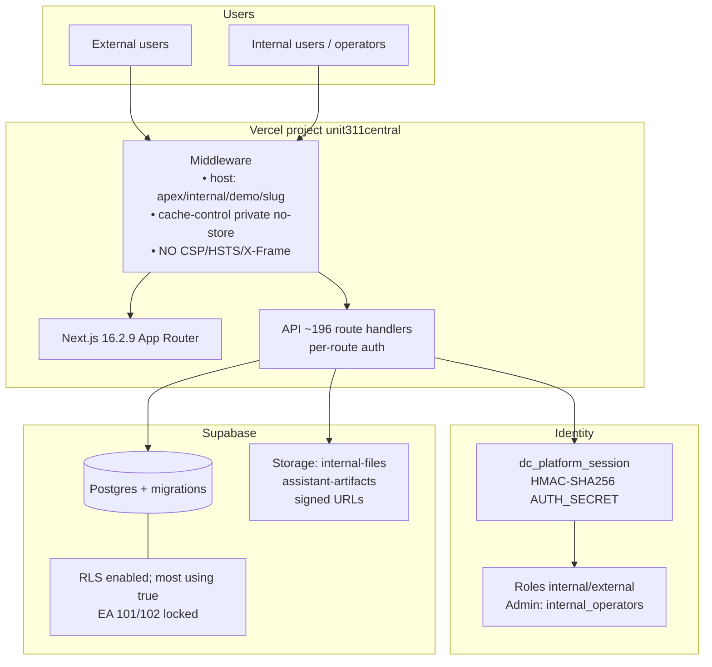

# Technical Security Architecture

| Field | Value |
|---|---|
| Document ID | CRA-13 |
| Version | 1.0 |
| Status | Draft — evidence-based baseline |
| Owner | Unit311 Platform Engineering / Security |
| Last updated | 2026-07-22 |
| Related documents | CRA-01 Overview; CRA-05 Authentication; CRA-06 Cryptography; CRA-14 Risk Assessment |

## 1. Purpose

Capture the as-built security architecture of Unit311central from audit evidence. This is a descriptive baseline, not an aspirational design. Gaps are labeled for remediation toward December 2027.

## 2. Context diagram

## 3. Layered controls (observed)

| Layer | Controls present | Controls absent |
|---|---|---|
| Edge / HTTP | Vercel TLS; middleware host routing; `private, no-store` | CSP, HSTS, X-Frame-Options; app rate limiting |
| Application | Cookie session; scrypt passwords; workspace auth (many routes); AES-256-GCM field crypto | Global auth middleware; CSRF tokens; MFA |
| Data | Migrations; EA tables service-role only; private buckets | Strong RLS on most tables; consistently tight storage policies |
| Ops | Vercel Instant Rollback; GitHub `main` | Dependabot; SBOM; Sentry; formal DR/BCP |

## 4. Host and tenancy routing

Middleware performs host-based routing across **apex**, **internal**, **demo**, and **slug** hosts. This separates product surfaces but **does not authenticate**. Security isolation between hosts must still rely on session checks inside pages/API handlers.

## 5. API security architecture

- Approximately **196** route handlers implement authentication individually.
- Cron routes use **`CRON_SECRET`** bearer authentication.
- Documented unevenness: **competitors** routes observed open; **WhatsApp** shared secret optional.
- **Compliance gap:** No CSRF tokens for cookie-authenticated state changes.
- **Compliance gap:** No application-level rate limiting.

Target architecture: a shared auth guard (deny-by-default) with explicit public allowlist, plus edge rate limits and CSRF for mutating methods (CRA-05).

## 6. Data plane

| Component | Architecture note |
|---|---|
| Supabase Postgres | Schema evolved via `supabase/migrations` |
| RLS | Enabled on most tables with `using(true)` — permissive |
| EA domain | Migrations 101/102 locked; no open policies; service-role access |
| Storage | Private buckets; signed URLs; historically permissive policies |

**Compliance gap:** Application authorization is the effective control for most tables. Defense-in-depth requires tighter RLS predicates aligned to user/workspace identity.

## 7. Cryptography placement

| Data | Protection |
|---|---|
| Session cookie | HMAC-SHA256 (`AUTH_SECRET`); httpOnly; sameSite lax; secure in prod |
| Passwords | scrypt; deterministic salt `${username}-salt-v1` (**Compliance gap**) |
| Software-asset passwords | AES-256-GCM (`AUTH_SECRET`) |
| Integration credentials | AES-256-GCM (`INTEGRATION_CREDENTIALS_SECRET`) |
| In transit | TLS via Vercel |

## 8. Security headers baseline

| Header | Configured in next.config.ts / vercel.json / middleware? |
|---|---|
| Content-Security-Policy | **No — Compliance gap** |
| Strict-Transport-Security | **No — Compliance gap** |
| X-Frame-Options / frame-ancestors | **No — Compliance gap** |

Recommendation: implement via middleware or Vercel header config; stage CSP in report-only first.

## 9. Observability architecture

| Capability | State |
|---|---|
| Logging | `console` |
| UI isolation | `WorkspaceErrorBoundary` |
| Centralized APM / Sentry | **Absent — Compliance gap** |

## 10. Trust and deploy architecture

GitHub `main` is continuously deployed by Vercel Git. Supply-chain and release risks are architectural (CRA-07, CRA-12). Instant Rollback is the primary rapid recovery control at the application layer (CRA-15).

## 11. Target architecture deltas (summary)

1. Global auth + CSRF + rate limits.
2. MFA for privileged users.
3. Random password salts; split crypto keys.
4. Security headers.
5. Least-privilege RLS and storage policies.
6. SBOM + Dependabot + web CI.
7. Centralized error/security monitoring.
8. Formal RTO/RPO and IR integration.

Track implementation in CRA-19; re-assess residual risk in CRA-14.
