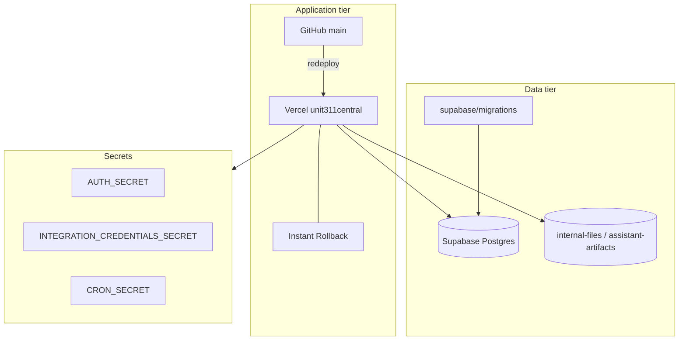

# Disaster Recovery

| Field | Value |
|---|---|
| Document ID | CRA-15 |
| Version | 1.0 |
| Status | Draft — evidence-based baseline |
| Owner | Unit311 Platform Engineering / Security |
| Last updated | 2026-07-22 |
| Related documents | CRA-16 Business Continuity; CRA-10 Incident Response; CRA-12 Release Management; CRA-06 Cryptography |

## 1. Purpose

Document Unit311’s disaster recovery (DR) capabilities as observed and define the formal RTO/RPO work still required for CRA-aligned resilience by December 2027.

## 2. Current recovery capability (audit)

| Capability | Status |
|---|---|
| Application rollback | **Vercel Instant Rollback** available |
| Ad-hoc recovery notes | `RELEASE_NOTES_RECOVERY_2026-07.md` |
| Formal RTO | **Not defined — Compliance gap** |
| Formal RPO | **Not defined — Compliance gap** |
| Formal DR plan / tested failover | **Not established — Compliance gap** |
| Formal BCP | See CRA-16 (also absent) |
| Centralized monitoring to trigger DR | No Sentry; console / `WorkspaceErrorBoundary` |

## 3. System dependencies for recovery

## 4. Failure scenarios and responses

| Scenario | Detection (current) | Recovery action | Gap |
|---|---|---|---|
| Bad application deploy | User reports / console errors | Vercel Instant Rollback; consult `RELEASE_NOTES_RECOVERY_2026-07.md` | No formal RTO |
| Corrupted release on `main` | Deploy failure or post-deploy defects | Revert commit; redeploy; optional Instant Rollback | Thin CI increases likelihood |
| Secret compromise | Suspected abuse | Rotate `AUTH_SECRET` / `INTEGRATION_CREDENTIALS_SECRET` / `CRON_SECRET`; redeploy; force sessions invalid | No practiced runbook evidence |
| Supabase data loss / corruption | Operational discovery | Restore from Supabase backups/PITR **if enabled at project** — must be verified and documented | **Compliance gap:** provider backup settings not evidenced in this pack |
| Storage object loss | User/operator report | Restore from provider backup if available; re-issue signed URLs | Policy/backup evidence needed |
| Regional Vercel outage | External status | Wait/provider guidance; communicate per CRA-16 | No alternate region runbook |

## 5. Target RTO / RPO (to be approved)

| Service tier | Proposed RTO | Proposed RPO | Notes |
|---|---|---|---|
| Marketing / public pages | 8 hours | 24 hours | Lower criticality |
| Authenticated workspaces | 4 hours | 1 hour | Session + tenant data |
| Executive Assistant / sensitive locked tables | 4 hours | 15–60 minutes | Service-role data; validate backup |
| Cron / integrations | 8 hours | 1 hour | After secret rotation if needed |

**Compliance gap:** Values above are **proposals only** until business owners approve and tests prove achievability. Do not cite as contractual commitments until validated.

## 6. Recovery runbooks (minimum set)

### 6.1 Application Instant Rollback

1. IC declares Sev impacting availability/integrity (CRA-10).
2. Identify last known-good Vercel deployment.
3. Execute Instant Rollback.
4. Verify login (`dc_platform_session`), sample API auth, and host routing (apex/internal/demo/slug).
5. Record deployment IDs in CRA-18; open CRA-19 for root cause.

### 6.2 Secret rotation recovery

1. Generate new secrets in Vercel env.
2. Redeploy application.
3. Re-encrypt or re-enter integration credentials if `INTEGRATION_CREDENTIALS_SECRET` changed.
4. Expect session invalidation when `AUTH_SECRET` changes; communicate to operators.
5. Update cron consumers with new `CRON_SECRET`.

### 6.3 Data restore (target)

1. Confirm Supabase backup / PITR configuration (evidence in CRA-18).
2. Restore to point consistent with approved RPO.
3. Re-apply migrations only as required; avoid duplicate destructive migrations.
4. Validate RLS posture — especially EA 101/102 locked tables and any tightened policies.

## 7. Backups evidence requirements

| Evidence item | Required for CRA readiness |
|---|---|
| Supabase backup retention settings | Yes |
| Last successful restore test date | Yes |
| Vercel rollback drill date | Yes |
| Secret rotation drill date | Yes |

**Compliance gap:** These evidences are not yet attached. Recommendation: complete first restore and rollback drills in 2026 H2 per CRA-02 Phase C.

## 8. Relationship to BCP

DR restores technical services; **CRA-16 Business Continuity** covers people, communications, and manual workarounds when systems remain degraded. Both must reference the same severity model (CRA-10).

## 9. Compliance gaps summary

| Gap | Recommendation → Dec 2027 |
|---|---|
| **Compliance gap — no formal RTO/RPO** | Approve targets; publish |
| **Compliance gap — no tested DR plan** | Runbooks + annual tests |
| **Compliance gap — ad-hoc notes only** | Promote recovery notes into controlled procedures |
| **Compliance gap — weak detection** | Monitoring to trigger DR promptly (CRA-10) |
