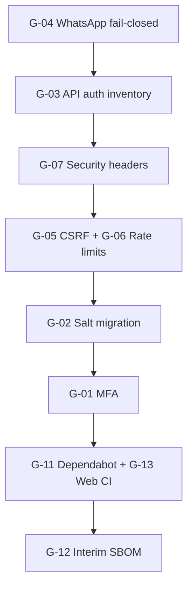

# Compliance Gaps to Fix

| Field | Value |
|---|---|
| Document ID | CRA-20 |
| Version | 1.0 |
| Status | Active remediation guide |
| Owner | Unit311 Platform Engineering / Security |
| Last updated | 2026-07-22 |
| Related documents | CRA-17 Gap Analysis; CRA-19 Action Tracker; CRA-02 Roadmap; CRA-14 Risk Assessment |

## 1. Purpose

Practical list of Cyber Resilience Act compliance gaps that Unit311 must remediate, with concrete how-to guidance. Derived from the 2026-07 platform audit and CRA-17 / CRA-19. Gaps are ordered by urgency: **do now**, **do next**, then **process / resilience before Dec 2027**.

## 2. Do now (P0 — security exposure)

| Gap | Problem | How to remediate |
|---|---|---|
| **G-04** WhatsApp secret optional | Webhook can accept traffic if secret unset | Fail closed: require shared secret in all environments; reject requests if missing |
| **G-03** Uneven API auth | Competitors (and similar) routes unprotected; auth is per-route | Inventory ~196 routes; deny-by-default API guard; lock or formally document public exceptions |
| **G-07** No security headers | No CSP / HSTS / X-Frame in app config | Add headers in `next.config` or middleware: CSP (report-only → enforce), HSTS, `X-Frame-Options` / `frame-ancestors`, `X-Content-Type-Options`, Referrer-Policy |
| **G-05** No CSRF | Cookie session + mutating APIs | Origin/Referer checks or CSRF tokens on state-changing routes |
| **G-06** No rate limiting | Login / abuse-prone APIs open to brute force | Rate-limit login and high-risk endpoints (edge middleware or route-level) |
| **G-02** Deterministic password salt | Salt is `${username}-salt-v1` | Per-user random salt + migration for existing hashes |
| **G-01** No login MFA | Operators/admins have no MFA | MFA for Admin / `internal_operators` first, then all internal users |
| **G-08** Open RLS (`using (true)`) | Most tables rely on app auth, not DB policies | Tighten tenant RLS; keep EA migrations 101/102 locked pattern as the model |
| **G-09** Permissive storage policies | Bucket policies historically too open | Least-privilege policies on `internal-files` / `assistant-artifacts` |

**Tracker refs:** ACT-001–ACT-010, ACT-023 (CRA-19).

## 3. Do next (P1 — supply chain / release assurance)

| Gap | Problem | How to remediate |
|---|---|---|
| **G-11** No Dependabot | Dependencies not auto-scanned | Enable Dependabot or Renovate on npm / `package-lock.json` |
| **G-13** Thin web CI | Only Android APK workflow | GitHub Actions: install, lint, test, `npm audit` / dependency review on PRs |
| **G-12** No SBOM | No software bill of materials | Generate CycloneDX/SPDX on `main` releases; interim: archive `package-lock.json` per release |
| **G-10** `AUTH_SECRET` dual-use | Same secret for HMAC sessions + AES field crypto | Split keys: session HMAC vs field-encryption secret |

**Tracker refs:** ACT-011–ACT-014, ACT-021 (CRA-19).

## 4. Process / resilience (P2 — before December 2027)

| Gap | Problem | How to remediate |
|---|---|---|
| **G-14** No vuln process | No intake / SLA / disclosure | Publish security contact + vulnerability handling SLAs (see CRA-09) |
| **G-15** No IR plan / monitoring | No formal incident response; console-only errors | Adopt IR plan; on-call roster; tabletop exercise; add Sentry (or equivalent) |
| **G-19** Weak logging | No centralized security monitoring | Structured logs + alerting (pair with G-15) |
| **G-16** No update policy | Security patching informal | Approve and publish Security Update Policy (CRA-11) |
| **G-17** No formal DR | Only Instant Rollback + ad-hoc notes | Define RTO/RPO; rollback + restore runbooks; drill |
| **G-18** No BCP | No business continuity plan | Contact tree, workarounds, joint tabletop with DR |

**Tracker refs:** ACT-015–ACT-020, ACT-022, ACT-024 (CRA-19).

## 5. Suggested order this quarter

1. WhatsApp fail-closed (**G-04** / ACT-003)
2. API auth inventory + close open routes (**G-03** / ACT-001, ACT-002)
3. Security headers (**G-07** / ACT-010)
4. CSRF + rate limits (**G-05**, **G-06** / ACT-006, ACT-007)
5. Password salt migration → MFA (**G-02**, **G-01** / ACT-005, ACT-004)
6. Dependabot + web CI (+ lockfile archive as interim SBOM) (**G-11**, **G-13**, **G-12** / ACT-011, ACT-013, ACT-021)

## 6. Definition of done

A gap is remediated when:

- Production behaviour on Vercel project `unit311central` matches the intended control
- CRA-19 action status is `Closed` (or `Risk accepted` with CRA-14 entry + expiry)
- CRA-18 evidence is updated to Observed / Partial with follow-up
- This document’s status note is refreshed on the next quarterly review

## 7. Where to track progress

| Document | Use for |
|---|---|
| **17 - Compliance Gap Analysis** | Full gap inventory and severity |
| **19 - Action Tracker** | Action IDs, owners, targets, status |
| **02 - CRA Compliance Roadmap** | Phase plan to December 2027 |
| **This document (CRA-20)** | Executive “what to fix and how” guide |
